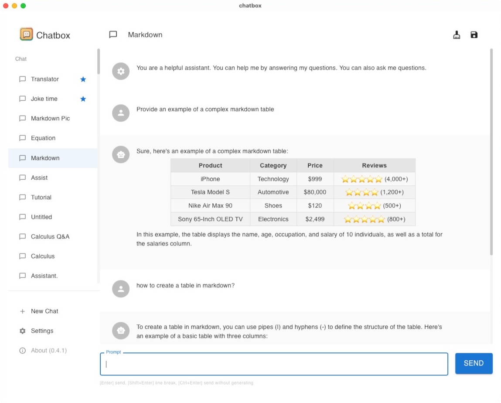

<h1 align="center">

<span>Chatbox</span>
</h1>
<p align="center">
    <a href="./README.md">English</a> | 中文介绍
</p>
<p align="center">
    <em>开源的 ChatGPT API (OpenAI API) 桌面客户端，Prompt 的调试与管理工具，支持 Windows、Mac 和 Linux</em>
</p>


<p align="center">
<a href="https://github.com/Bin-Huang/chatbox/releases" target="_blank">

</a>
<a href="https://github.com/Bin-Huang/chatbox/releases" target="_blank">

</a>
<a href="https://github.com/Bin-Huang/chatbox/releases" target="_blank">

</a>
<a href="https://github.com/Bin-Huang/chatbox/releases" target="_blank">

</a>
<a href="https://twitter.com/benn_huang" target="_blank">

</a>
</p>

<table>
<tr>
<td>

</td>
<td>

</td>
</tr>
</table>


## 特性

- 更自由、更强大的 Prompt 能力
- 数据存储在本地，不会丢失
- 支持 GPT-4 和其他模型
- 支持自定义域名代理
- 适合团队办公，支持在团队中共享 OpenAI API 资源，[查看教程](./team-sharing/README-CN.md)
- 更多功能：Markdown、消息引用、字数与token估算、夜间模式……
- 符合人体工程学的 UI 设计
- 提供安装包，无需部署
- 免费，开源

## 下载

*Chatbox 支持所有的主流操作系统，包括： Windows、 Mac (Intel, M1) 和 Linux。*

### 从官方网站下载

请访问 **[chatboxai.app](https://chatboxai.app/)** 下载最新版本。

### 从 Github Releases 下载

您可以访问 **[Github Releases](https://github.com/Bin-Huang/chatbox/releases)** 浏览并下载所有历史版本。

### 通过包管理器下载

#### [aur](https://aur.archlinux.org/packages/chatbox-bin)

如果您使用的是 Arch Linux，可以通过 AUR 下载并安装 Chatbox：

```
paru -S chatbox-bin
```

## Chatbox 团队共享功能

用 AI 来提高团队生产力，是 Chatbox 的一个重要特性。Chatbox 可以让你的团队成员共享同一个 OpenAI API 账号的资源，同时不会暴露你的 API KEY。

点击这里[查看教程](./team-sharing/README-CN.md)。

## 为什么我开发了 Chatbox？

刚开始我只是在调试一些 prompt，我发现自己非常需要一个简单好用的 prompt 和接口调试工具，所以我开发了最初版本的 Chatbox。我觉得可能有更多的人需要这样的工具，所以我把它开源出来。

那时我还不知道会有这么多人喜欢它。于是我尽量听取开源社区的反馈，不断开发和完善它，现在它已经变成了一个非常好用的 AI 桌面应用。现在有很多喜欢 Chatbox 的用户，他们不仅仅在开发和调试 prompt，而且还使用它来日常聊天，甚至用它来做一些更加有趣的事情，比如利用精心设计的 prompt 让 AI 扮演各种专业的角色，来辅助他们进行一些日常的工作……

## ChatBox 和 (OpenAI API) 的关系

- ChatBox 仅提供了UI界面帮助你更好的使用 ChatGPT API (OpenAI API). 
- 任何和 ChatGPT API (OpenAI API) 相关的问题，请移步 [platform openai](https://platform.openai.com/)

## Roadmap

- [x] AI 聊天与会话管理
- [x] 聊天消息与会话的本地存储
- [x] 会话消息内容的格式美化（markdown）
- [x] Streaming 打字机特效
- [x] API Host 配置
- [x] 自动生成标签页的标题
- [x] 消息清理的按钮
- [x] 夜间模式
- [x] 消息的 token 估算
- [x] GPT4 的支持
- [x] 中文（简体、繁体）
- [x] 代码块的复制按钮
- [x] 停止生成的按钮
- [x] 标签页的拖拽排序
- [x] [网页版本](https://web.chatboxai.app)
- [x] 兼容 Azure OpenAI API
- [ ] 更好的 prompt 设置
- [ ] Prompt Library
- [ ] 可以发送文件，谈论文件
- [ ] 可以发送链接，谈论网页
- [ ] 移动端（iOS、Android）
- [ ] 跨设备的会话同步
- [ ] threads(就像 Slack 一样)
- 更多...

## 如何贡献

欢迎任何形式的贡献，包括但不限于：

- 提交 pull request
- 提交 feature request
- 提交 bug report
- 提交文档校订
- 提交翻译
- 提交其他任何形式的贡献
- 提交 issue

请注意：
1. 在提交 issue 之前，请确保没有重复话题的 issue。
2. 请确保标题足够的简洁明了，描述足够的详细。

## 感谢赞助商

作为一个开源项目，我非常感激Chatbox背后的赞助商的支持。他们的协助对我继续开发和改进这个开源软件至关重要。

<a href="https://chatboxai.app/sponsor_redirect/eolink_gh">

</a>


## Chatbox 期待赞助商！

作为一个开源项目，ChatBox 在社区的贡献和支持下才得以持续发展。如果您或您的组织认为 Chatbox 的工作有价值，欢迎您的赞助，支持 Chatbox 可持续的开发与迭代，并造福所有人。为表达感激，我会在 README 文件和其他适当的位置显著地展示赞助商的相关信息。感谢您考虑支持 Chatbox 的工作！

如果您有任何的兴趣或想法，欢迎联系 tohuangbin@gmail.com 。

## 请熬夜的开发者喝瓶可乐？

[](https://buymeacoffee.com/benn)

| Paypal | Wechat Pay | Ali Pay |
| --- | --- | --- |
| [**`Paypal`**](https://www.paypal.me/tobennhuang) |  |  |

## Star History

[](https://star-history.com/#Bin-Huang/chatbox&Date)

## 联系开发者

- [Twitter](https://twitter.com/benn_huang)
- [Email](mailto:tohuangbin@gmail.com)
- [Blog](https://bennhuang.com)

## License

[GNU General Public License v3.0](./LICENSE)
