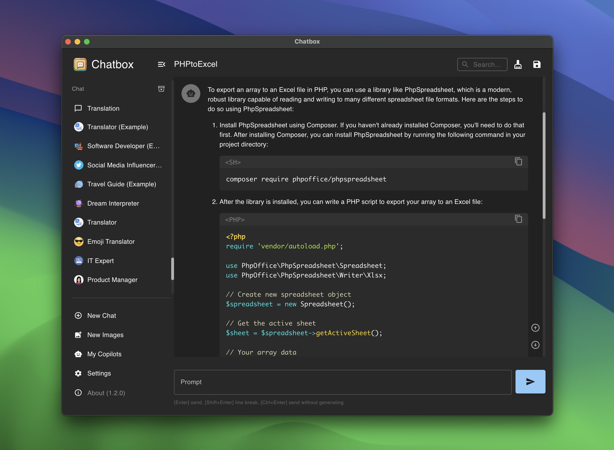

<p align="right">
  <a href="README.md">English</a> |
  <a href="README-CN.md">简体中文</a>
</p>

这里是 Chatbox 社区版的代码仓库，以 GPLv3 许可证开源。对大多数用户来说，更建议直接使用 Chatbox 官方版（闭源）。它仍然完全免费，安装简单，而且支持更多最新功能。你可以在下面获取：

### 下载电脑端

<table style="width: 100%">
  <tr>
    <td width="25%" align="center">
      <b>Windows</b>
    </td>
    <td width="25%" align="center" colspan="2">
      <b>MacOS</b>
    </td>
    <td width="25%" align="center">
      <b>Linux</b>
    </td>
  </tr>
  <tr style="text-align: center">
    <td align="center" valign="middle">
      <a href='https://chatboxai.app/?c=download-windows'>
        
        <br />
        <b>Setup.exe</b>
      </a>
    </td>
    <td align="center" valign="middle">
      <a href='https://chatboxai.app/?c=download-mac-intel'>
        
        <br />
        <b>Intel</b>
      </a>
    </td>
    <td align="center" valign="middle">
      <a href='https://chatboxai.app/?c=download-mac-aarch'>
        
        <br />
        <b>M1/M2</b>
      </a>
    </td>
    <td align="center" valign="middle">
      <a href='https://chatboxai.app/?c=download-linux'>
        
        <br />
        <b>AppImage</b>
      </a>
    </td>
  </tr>
</table>

### 下载移动端

<a href='https://apps.apple.com/app/chatbox-ai/id6471368056' style='margin-right: 4px'>

</a>
<a href='https://play.google.com/store/apps/details?id=xyz.chatboxapp.chatbox' style='margin-right: 4px'>

</a>
<a href='https://chatboxai.app/zh/install?download=android_apk' style='margin-right: 4px; display: inline-flex; justify-content: center'>

.APK
</a>

更多信息请访问: [chatboxai.app](https://chatboxai.app/)

---


<h1 align="center">

<span>
    Chatbox
    <span style="font-size:8px; font-weight: normal;">(Community Edition)</span>
</span>
</h1>
<p align="center">
    <em>Chatbox 是一个 AI 模型桌面客户端，支持 ChatGPT、Claude、Google Gemini、Ollama 等主流模型，适用于 Windows、Mac、Linux、Web、Android 和 iOS 全平台</em>
</p>

<p align="center">
<a href="https://github.com/Bin-Huang/chatbox/releases" target="_blank">

</a>
<a href="https://github.com/Bin-Huang/chatbox/releases" target="_blank">

</a>
<a href="https://github.com/Bin-Huang/chatbox/releases" target="_blank">

</a>
<a href="https://github.com/Bin-Huang/chatbox/releases" target="_blank">

</a>
<a href="https://twitter.com/benn_huang" target="_blank">

</a>
</p>

<a href="https://www.producthunt.com/posts/chatbox?utm_source=badge-featured&utm_medium=badge&utm_souce=badge-chatbox" target="_blank"></a>




## 特性

-   **本地数据存储**  
    :floppy_disk: 您的数据保留在您的设备上，确保数据永不丢失并保护您的隐私。

-   **无需部署、直接安装的安装包**  
    :package: 通过可下载的安装包快速开始使用。无需复杂设置！

-   **支持多个 LLM 提供商**  
    :gear: 无缝集成多种 AI 模型：

    -   OpenAI (ChatGPT)
    -   Azure OpenAI
    -   Claude
    -   Google Gemini Pro
    -   Ollama (启用对本地模型的访问，如 llama2、Mistral、Mixtral、codellama、vicuna、yi 和 solar)
    -   ChatGLM-6B

-   **使用 Dall-E-3 生成图像**  
    :art: 使用 Dall-E-3 创建您想象中的图像。

-   **增强提示**  
    :speech_balloon: 高级提示功能，精炼并聚焦您的查询以获得更好的响应。

-   **键盘快捷键**  
    :keyboard: 使用加速您工作流程的快捷键保持高效。

-   **Markdown、Latex 和代码高亮**  
    :scroll: 使用 Markdown 和 Latex 的全部功能生成消息，并结合各种编程语言的语法高亮，提高可读性和呈现效果。

-   **提示库和消息引用**  
    :books: 保存和组织提示以供重复使用，并引用消息以在讨论中提供上下文。

-   **流式回复**  
    :arrow_forward: 通过即时、渐进式回复快速响应您的互动。

-   **人体工程学 UI 和深色主题**  
    :new_moon: 用户友好的界面，带有夜间模式选项，减少长时间使用时的眼睛疲劳。

-   **团队协作**  
    :busts_in_silhouette: 轻松协作并在团队中共享 OpenAI API 资源。[了解更多](./team-sharing/README.md)

-   **跨平台可用性**  
    :computer: 聊天盒已为 Windows、Mac、Linux 用户准备就绪。

-   **通过 Web 版本随处访问**  
    :globe_with_meridians: 在任何设备上使用带有浏览器的 Web 应用程序，随时随地。

-   **iOS 和 Android**  
    :phone: 使用移动应用程序，随时随地在您的指尖上带来这种能力。

-   **多语言支持**  
    :earth_americas: 通过提供多种语言的支持，迎合全球受众：

    -   English
    -   简体中文 (Simplified Chinese)
    -   繁體中文 (Traditional Chinese)
    -   日本語 (Japanese)
    -   한국어 (Korean)
    -   Français (French)
    -   Deutsch (German)
    -   Русский (Russian)

-   **更多...**  
    :sparkles: 不断增强体验，加入新功能！

## 常见问题解答

-   [常见问题](./FAQ.md)

## 如何贡献

欢迎任何形式的贡献，包括但不限于：

-   提交问题
-   提交拉取请求
-   提交功能请求
-   提交错误报告
-   提交文档修订
-   提交翻译
-   提交任何其他形式的贡献

## 构建指南

1. 从 Github 克隆仓库

```bash
git clone https://github.com/Bin-Huang/chatbox.git
```

2. 安装所需的依赖

```bash
npm install
```

3. 启动应用程序（开发模式）

```bash
npm run dev
```

4. 构建应用程序，为当前平台打包安装程序

```bash
npm run package
```

5. 构建应用程序，为所有平台打包安装程序

```bash
npm run package:all
```

## 请我喝咖啡

[](https://buymeacoffee.com/benn)

| Paypal                                            | 微信支付                                        | 支付宝                                      |
| ------------------------------------------------- | ----------------------------------------------- | -------------------------------------------- |
| [**`Paypal`**](https://www.paypal.me/tobennhuang) |  |  |

## Star History

[](https://star-history.com/#Bin-Huang/chatbox&Date)

## 联系方式

[Twitter](https://twitter.com/benn_huang) | [电子邮件](mailto:tohuangbin@gmail.com) | [博客](https://bennhuang.com)
