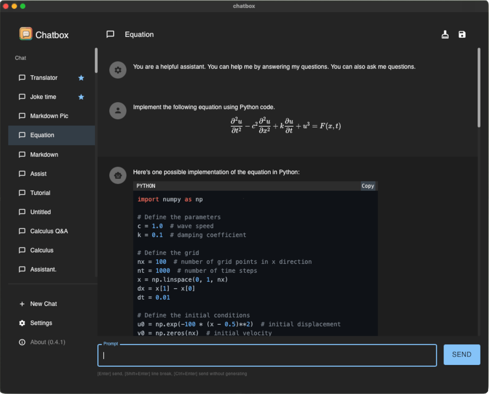

<h1 align="center">

Chatbox
</h1>

    <a href="./README.md">English</a> | 中文介绍 | <a href="./README-TC.md">繁體中文介紹</a>

    <em>AI好助手！Chatbox 是一个支持多款最先进的大语言模型（LLM）的桌面客户端，适用于 Windows、Mac 和 Linux</em>

<table>
<tr>
<td>

</td>
<td>

</td>
</tr>
</table>

## 特性

- 更自由、更强大的 Prompt 能力
- 数据存储在本地，不会丢失
- 内置开箱即用的 AI 服务，API KEY 是可选的
- 支持 OpenAI, Azure OpenAI 和 ChatGLM-6B
- 支持自定义域名代理
- Markdown 和代码高亮
- 提示词图书馆，消息引用
- 流式回复，打字机特效
- 符合人体工程学的 UI 设计，夜间模式
- 适合团队办公，支持在团队中共享 OpenAI API 资源，[查看教程](./team-sharing/README-CN.md)
- 提供安装包，无需部署
- 免费，开源

## 下载安装包

### 官网下载

<table>
  <tr>
    <td style="text-align:center"><b>Windows</b></td>
    <td colspan="2" style="text-align:center"><b>MacOS</b></td>
    <td style="text-align:center"><b>Linux</b></td>
  </tr>
  <tr>
    <td>
      <b><a href='https://chatboxai.app/cn/?c=download-windows'>下载 Setup.exe</a></b>
    </td>
    <td>
      <b><a href='https://chatboxai.app/cn/?c=download-mac-intel'>Mac Intel 安装包</a></b>
    </td>
    <td>
      <b><a href='https://chatboxai.app/cn/?c=download-mac-aarch'>Mac M1/M2 安装包</a></b>
    </td>
    <td>
      <b><a href='https://chatboxai.app/cn/?c=download-linux'>AppImage 安装包</a></b>
    </td>
  </tr>
</table>

### 从 GitHub Releases 下载

访问 **[GitHub Releases](https://github.com/Bin-Huang/chatbox/releases)** 下载最新版本与历史版本的安装包。

## 常见问题与解答

- [Frequently Asked Questions](./FAQ.md)
- [常见问题与解答](./FAQ-CN.md)
- [常見問題與解答](./FAQ-TC.md)
## Chatbox 团队共享功能

用 AI 来提高团队生产力，是 Chatbox 的一个重要特性。Chatbox 可以让你的团队成员共享同一个 OpenAI API 账号的资源，同时不会暴露你的 API KEY。

点击这里[查看教程](./team-sharing/README-CN.md)。

## 为什么我开发了 Chatbox？

刚开始我只是在调试一些 prompt，我发现自己非常需要一个简单好用的 prompt 和接口调试工具，所以我开发了最初版本的 Chatbox。我觉得可能有更多的人需要这样的工具，所以我把它开源出来。

那时我还不知道会有这么多人喜欢它。于是我尽量听取开源社区的反馈，不断开发和完善它，现在它已经变成了一个非常好用的 AI 桌面应用。现在有很多喜欢 Chatbox 的用户，他们不仅仅在开发和调试 prompt，而且还使用它来日常聊天，甚至用它来做一些更加有趣的事情，比如利用精心设计的 prompt 让 AI 扮演各种专业的角色，来辅助他们进行一些日常的工作……

## Roadmap

- [x] AI 聊天与会话管理
- [x] 聊天消息与会话的本地存储
- [x] 会话消息内容的格式美化（markdown）
- [x] Streaming 打字机特效
- [x] API Host 配置
- [x] 自动生成标签页的标题
- [x] 消息清理的按钮
- [x] 夜间模式
- [x] 消息的 token 估算
- [x] GPT4 的支持
- [x] 中文（简体、繁体）
- [x] 代码块的复制按钮
- [x] 停止生成的按钮
- [x] 标签页的拖拽排序
- [x] [网页版本](https://web.chatboxai.app)
- [x] 兼容 Azure OpenAI API
- [x] 更好的 prompt 设置
- [x] Prompt Library
- [x] 内置 AI 服务，开箱即用
- [ ] 可以发送文件，谈论文件
- [ ] 可以发送链接，谈论网页
- [ ] 移动端（iOS、Android）
- [ ] 跨设备的会话同步
- [ ] threads(就像 Slack 一样)
- 更多...

## 如何贡献

欢迎任何形式的贡献，包括但不限于：

- 提交 pull request
- 提交 feature request
- 提交 bug report
- 提交文档校订
- 提交翻译
- 提交其他任何形式的贡献
- 提交 issue

请注意：
1. 在提交 issue 之前，请确保没有重复话题的 issue。
2. 请确保标题足够的简洁明了，描述足够的详细。

## 请熬夜的开发者喝瓶可乐？

| Paypal | Wechat Pay | Ali Pay |
| --- | --- | --- |
| [**`Paypal`**](https://www.paypal.me/tobennhuang) |  |  |

## Star History

## 联系开发者

- [Twitter](https://twitter.com/benn_huang)
- [Email](mailto:tohuangbin@gmail.com)
- [Blog](https://bennhuang.com)

## License

[GNU General Public License v3.0](./LICENSE)
