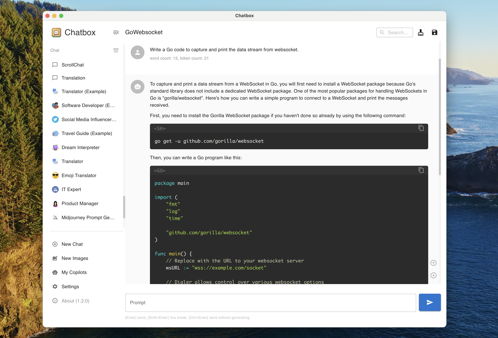

<p align="right">
  <a href="README.md">English</a> |
  <a href="README-CN.md">简体中文</a> |
  <a href="README-JP.md">日本語</a>
</p>

<h1 align="center">

<span>Chatbox</span>
</h1>
<p align="center">
    <em>Chatboxは、ChatGPT、Claude、Google Gemini、Ollamaなどの主要なAIモデルをサポートするデスクトップクライアントで、Windows、Mac、Linux、Web、Android、iOSの全プラットフォームに対応しています。</em>
</p>

<p align="center">
<a href="https://github.com/Bin-Huang/chatbox/releases" target="_blank">

</a>
<a href="https://github.com/Bin-Huang/chatbox/releases" target="_blank">

</a>
<a href="https://github.com/Bin-Huang/chatbox/releases" target="_blank">

</a>
<a href="https://github.com/Bin-Huang/chatbox/releases" target="_blank">

</a>
<a href="https://twitter.com/benn_huang" target="_blank">

</a>
</p>

## ⏬ デスクトップ版のダウンロード

<table style="width: 100%">
  <tr>
    <td width="25%" align="center">
      <b>Windows</b>
    </td>
    <td width="25%" align="center" colspan="2">
      <b>MacOS</b>
    </td>
    <td width="25%" align="center">
      <b>Linux</b>
    </td>
  </tr>
  <tr style="text-align: center">
    <td align="center" valign="middle">
      <a href='https://chatboxai.app/?c=download-windows'>
        
        <br />
        <b>Setup.exe</b>
      </a>
    </td>
    <td align="center" valign="middle">
      <a href='https://chatboxai.app/?c=download-mac-intel'>
        
        <br />
        <b>Intel</b>
      </a>
    </td>
    <td align="center" valign="middle">
      <a href='https://chatboxai.app/?c=download-mac-aarch'>
        
        <br />
        <b>M1/M2</b>
      </a>
    </td>
    <td align="center" valign="middle">
      <a href='https://chatboxai.app/?c=download-linux'>
        
        <br />
        <b>AppImage</b>
      </a>
    </td>
  </tr>
</table>

または、**[GitHub Releases](https://github.com/Bin-Huang/chatbox/releases)** から最新バージョンや過去のリリースをダウンロードしてください。

## ⏬ iOS/Androidアプリのダウンロード

<a href='https://apps.apple.com/app/chatbox-ai/id6471368056' style='margin-right: 4px'>

</a>
<a href='https://play.google.com/store/apps/details?id=xyz.chatboxapp.chatbox' style='margin-right: 4px'>

</a>
<a href='https://chatboxai.app/zh/install?download=android_apk' style='margin-right: 4px; display: inline-flex; justify-content: center'>

.APK
</a>

## 🌟 特徴

<a href="https://www.producthunt.com/posts/chatbox?utm_source=badge-featured&utm_medium=badge&utm_souce=badge-chatbox" target="_blank"></a>




# 特徴

-   **ローカルデータストレージ**  
    :floppy_disk: データはデバイス上に保存され、データが失われることなくプライバシーが保護されます。

-   **デプロイ不要のインストールパッケージ**  
    :package: ダウンロード可能なインストールパッケージで迅速に開始できます。複雑な設定は不要です！

-   **複数のLLMプロバイダーをサポート**  
    :gear: 多様なAIモデルとシームレスに統合：

    -   OpenAI (ChatGPT)
    -   Azure OpenAI
    -   Claude
    -   Google Gemini Pro
    -   Ollama (llama2、Mistral、Mixtral、codellama、vicuna、yi、solarなどのローカルモデルへのアクセスを有効化)
    -   ChatGLM-6B

-   **Dall-E-3による画像生成**  
    :art: Dall-E-3を使用して、想像力豊かな画像を作成します。

-   **強化されたプロンプト**  
    :speech_balloon: 高度なプロンプト機能で、クエリを洗練し、焦点を絞ってより良い応答を得ることができます。

-   **キーボードショートカット**  
    :keyboard: ワークフローを加速するショートカットで生産性を維持します。

-   **Markdown、Latex、コードハイライト**  
    :scroll: MarkdownとLatexの全機能を使用してメッセージを生成し、さまざまなプログラミング言語のシンタックスハイライトを組み合わせて、可読性とプレゼンテーションを向上させます。

-   **プロンプトライブラリとメッセージ引用**  
    :books: プロンプトを保存して整理し、再利用し、ディスカッションでコンテキストを提供するためにメッセージを引用します。

-   **ストリーミング返信**  
    :arrow_forward: 即時かつ段階的な返信でインタラクションに迅速に対応します。

-   **エルゴノミックUIとダークテーマ**  
    :new_moon: ユーザーフレンドリーなインターフェースと夜間モードオプションで、長時間の使用時の目の疲れを軽減します。

-   **チームコラボレーション**  
    :busts_in_silhouette: 簡単にコラボレーションし、チーム内でOpenAI APIリソースを共有します。[詳細はこちら](./team-sharing/README.md)

-   **クロスプラットフォーム対応**  
    :computer: ChatboxはWindows、Mac、Linuxユーザーに対応しています。

-   **Webバージョンでどこでもアクセス可能**  
    :globe_with_meridians: ブラウザを使用して、どのデバイスからでもWebアプリケーションを使用できます。

-   **iOSとAndroid**  
    :phone: モバイルアプリケーションを使用して、外出先でもこの機能を指先で利用できます。

-   **多言語サポート**  
    :earth_americas: 多言語サポートを提供し、グローバルなオーディエンスに対応：

    -   English
    -   简体中文 (Simplified Chinese)
    -   繁體中文 (Traditional Chinese)
    -   日本語 (Japanese)
    -   한국어 (Korean)
    -   Français (French)
    -   Deutsch (German)
    -   Русский (Russian)

-   **その他多数...**  
    :sparkles: 新機能を追加し、体験を継続的に向上させます！

## FAQ

-   [よくある質問](./FAQ.md)

## 貢献方法

以下を含むがこれに限定されない、あらゆる形式の貢献を歓迎します：

-   問題の提出
-   プルリクエストの提出
-   機能リクエストの提出
-   バグレポートの提出
-   ドキュメントの修正
-   翻訳の提出
-   その他の形式の貢献

## ビルド手順

1. Githubからリポジトリをクローン

```bash
git clone https://github.com/Bin-Huang/chatbox.git
```

2. 必要な依存関係をインストール

```bash
npm install
```

3. アプリケーションを起動（開発モード）

```bash
npm run dev
```

4. アプリケーションをビルドし、現在のプラットフォーム用のインストーラーをパッケージ化

```bash
npm run package
```

5. アプリケーションをビルドし、すべてのプラットフォーム用のインストーラーをパッケージ化

```bash
npm run package:all
```

## コーヒーをおごる

[](https://buymeacoffee.com/benn)

| Paypal                                            | Wechat Pay                                      | Ali Pay                                      |
| ------------------------------------------------- | ----------------------------------------------- | -------------------------------------------- |
| [**`Paypal`**](https://www.paypal.me/tobennhuang) |  |  |

## Star History

[](https://star-history.com/#Bin-Huang/chatbox&Date)

## 連絡先

[Twitter](https://twitter.com/benn_huang) | [Email](mailto:tohuangbin@gmail.com) | [Blog](https://bennhuang.com)
