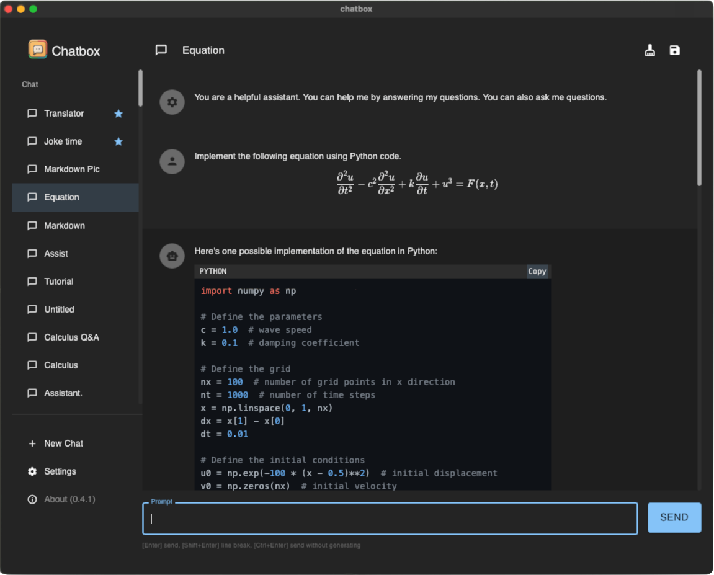

<h1 align="center">

Chatbox
</h1>

    English | <a href="./README-CN.md">中文介绍</a>

    <em>Your Ultimate AI Copilot on the Desktop.  Chatbox is a desktop app for GPT/LLM that supports Windows, Mac & Linux.</em>

<table>
<tr>
<td>

</td>
<td>

</td>
</tr>
</table>

## Features

- More free and powerful Prompt capability
- Data is stored locally and will not be lost
- Built-in AI services out of the box, API KEY is not required
- Support for OpenAI(GPT3.5, GPT4), Azure OpenAI and ChatGLM-6B
- Support for custom domain proxies
- Markdown & Code Highlighting
- Prompt Library, Message Quoting
- Streaming reply
- Ergonomic UI design & Night Mode
- Suitable for team collaboration, supporting the sharing of OpenAI API resources within the team. View [tutorial](./team-sharing/README.md)
- Providing installation packages, no deployment required
- Free and open source

## Download

### Download from the [Official Website](https://chatboxai.app)

<table>
  <tr>
    <td><b>Windows</b></td>
    <td colspan="2"><b>MacOS</b></td>
    <td><b>Linux</b></td>
  </tr>
  <tr>
    <td>
      <a href='https://chatboxai.app/?c=download-windows'>Get Setup.exe</a>
    </td>
    <td>
      <a href='https://chatboxai.app/?c=download-mac-intel'>Mac Intel Setup
</a>
    </td>
    <td>
      <a href='https://chatboxai.app/?c=download-mac-aarch'>Mac M1/M2 Setup</a>
    </td>
    <td>
      <a href='https://chatboxai.app/?c=download-linux'>AppImage</a>
    </td>
  </tr>
</table>

<table>
  <tr>
    <td>Use Online</td>
  </tr>
  <tr>
    <td>
      <a href='https://chatboxai.app/#download'>Try the web version(beta)</a>
    </td>
  </tr>
</table>

### Download from [GitHub Releases](https://github.com/Bin-Huang/chatbox/releases)

Visit the **[GitHub Releases](https://github.com/Bin-Huang/chatbox/releases)** to download the latest version or any previous release.

## FAQ

- [Frequently Asked Questions](./FAQ.md)
- [常见问题与解答](./FAQ-CN.md)

## Chatbox Team Sharing Feature

Using AI to enhance your team productivity, is an important feature of Chatbox.

Chatbox allows your team members to share the resources of the same OpenAI API account without exposing your API KEY. View [tutorial](./team-sharing/README.md).

## Why I made Chatbox?

I developed Chatbox initially because I was debugging some prompts and found myself in need of a simple and easy-to-use prompt and API debugging tool. I thought there might be more people who needed such a tool, so I open-sourced it.

At first, I didn't know that it would be so popular. I listened to the feedback from the open-source community and continued to develop and improve it. Now, it has become a very useful AI desktop application. There are many users who love Chatbox, and they not only use it for developing and debugging prompts, but also for daily chatting, and even to do some more interesting things like using well-designed prompts to make AI play various professional roles to assist them in everyday work...

## Roadmap

- [x] AI chat and session management
- [x] Store all your important message data locally.
- [x] Markdown
- [x] Streaming reply
- [x] API Host configuration
- [x] Automatically generate tab titles
- [x] Button for clearing messages.
- [x] Night/Dark mode
- [x] message token estimating
- [x] GPT4
- [x] i18n
- [x] Copy button for code blocks
- [x] Stop button for AI message generation
- [x] Drag-and-drop sorting of tabs
- [x] [Web version](https://web.chatboxai.app)
- [x] Azure OpenAI API compatibility
- [x] Improved prompt settings
- [x] Prompt Library
- [x] Built-in AI services out of the box
- [ ] Talk with files
- [ ] Talk with URLs
- [ ] Mobile(Android, iOS)
- [ ] Cross-device synchronization
- [ ] threads(like Slack)
- More...

## How to Contribute

Any form of contribution is welcome, including but not limited to:

- Submitting issues
- Submitting pull requests
- Submitting feature requests
- Submitting bug reports
- Submitting documentation revisions
- Submitting translations
- Submitting any other forms of contribution

## Buy Me a Coffee

| Paypal | Wechat Pay | Ali Pay |
| --- | --- | --- |
| [**`Paypal`**](https://www.paypal.me/tobennhuang) |  |  |

## Star History

## Contact

- [Twitter](https://twitter.com/benn_huang)
- [Email](mailto:tohuangbin@gmail.com)
- [Blog](https://bennhuang.com)

## License

[GNU General Public License v3.0](./LICENSE)
