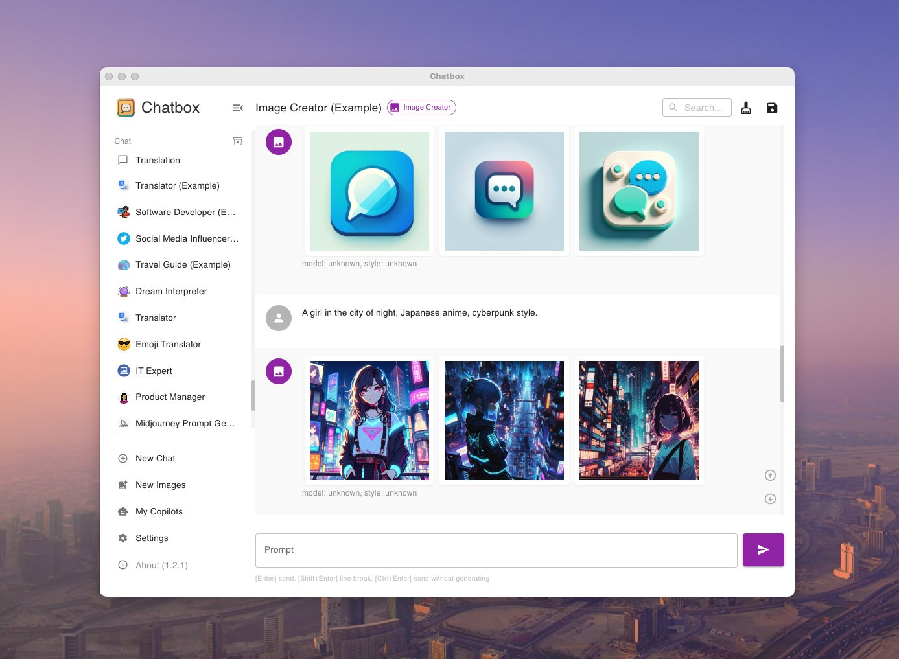

<p align="right">
  <a href="README.md">English</a> |
  <a href="README_cn.md">简体中文</a>
</p>


<h1 align="center">

<span>Chatbox</span>
</h1>
<p align="center">
    <em>Your Ultimate AI Copilot on the Desktop. <br />Chatbox is a desktop client for ChatGPT, Claude and other LLMs, available on Windows, Mac, Linux</em>
</p>

<p align="center">
<a href="https://github.com/Bin-Huang/chatbox/releases" target="_blank">

</a>
<a href="https://github.com/Bin-Huang/chatbox/releases" target="_blank">

</a>
<a href="https://github.com/Bin-Huang/chatbox/releases" target="_blank">

</a>
<a href="https://github.com/Bin-Huang/chatbox/releases" target="_blank">

</a>
<a href="https://twitter.com/benn_huang" target="_blank">

</a>
</p>

## ⏬ Download for Desktop

<table style="width: 100%">
  <tr>
    <td width="25%" align="center">
      <b>Windows</b>
    </td>
    <td width="25%" align="center" colspan="2">
      <b>MacOS</b>
    </td>
    <td width="25%" align="center">
      <b>Linux</b>
    </td>
  </tr>
  <tr style="text-align: center">
    <td align="center" valign="middle">
      <a href='https://chatboxai.app/?c=download-windows'>
        
        <br />
        <b>Setup.exe</b>
      </a>
    </td>
    <td align="center" valign="middle">
      <a href='https://chatboxai.app/?c=download-mac-intel'>
        
        <br />
        <b>Intel</b>
      </a>
    </td>
    <td align="center" valign="middle">
      <a href='https://chatboxai.app/?c=download-mac-aarch'>
        
        <br />
        <b>M1/M2</b>
      </a>
    </td>
    <td align="center" valign="middle">
      <a href='https://chatboxai.app/?c=download-linux'>
        
        <br />
        <b>AppImage</b>
      </a>
    </td>
  </tr>
</table>

Or visit the **[GitHub Releases](https://github.com/Bin-Huang/chatbox/releases)** to download the latest version or any previous release.

## ⏬ Download for iOS/Android

<a href='https://apps.apple.com/app/chatbox-ai/id6471368056' style='margin-right: 4px'>

</a>
<a href='https://play.google.com/store/apps/details?id=xyz.chatboxapp.chatbox' style='margin-right: 4px'>

</a>
<a href='https://chatboxai.app/zh/install?download=android_apk' style='margin-right: 4px; display: inline-flex; justify-content: center'>

.APK
</a>

## 🌟 Features

<a href="https://www.producthunt.com/posts/chatbox?utm_source=badge-featured&utm_medium=badge&utm_souce=badge-chatbox" target="_blank"></a>

<a href="./doc/demo_desktop_1.jpg"></a>
<a href="./doc/demo_desktop_2.jpg"></a>
<a href="./doc/demo_desktop_3.jpg"></a>

<!-- <table>
<tr>
<td>

</td>
<td>

</td>
</tr>
</table> -->

# Features

-   **Local Data Storage**  
    :floppy_disk: Your data remains on your device, ensuring it never gets lost and maintains your privacy.

-   **No-Deployment Installation Packages**  
    :package: Get started quickly with downloadable installation packages. No complex setup necessary!

-   **Support for Multiple LLM Providers**  
    :gear: Seamlessly integrate with a variety of cutting-edge language models:

    -   OpenAI (ChatGPT)
    -   Azure OpenAI
    -   Claude
    -   Google Gemini Pro
    -   Ollama (enable access to local models like llama2, Mistral, Mixtral, codellama, vicuna, yi, and solar)
    -   ChatGLM-6B

-   **Image Generation with Dall-E-3**  
    :art: Create the images of your imagination with Dall-E-3.

-   **Enhanced Prompting**  
    :speech_balloon: Advanced prompting features to refine and focus your queries for better responses.

-   **Keyboard Shortcuts**  
    :keyboard: Stay productive with shortcuts that speed up your workflow.

-   **Markdown, Latex & Code Highlighting**  
    :scroll: Generate messages with the full power of Markdown and Latex formatting, coupled with syntax highlighting for various programming languages, enhancing readability and presentation.

-   **Prompt Library & Message Quoting**  
    :books: Save and organize prompts for reuse, and quote messages for context in discussions.

-   **Streaming Reply**  
    :arrow_forward: Provide rapid responses to your interactions with immediate, progressive replies.

-   **Ergonomic UI & Dark Theme**  
    :new_moon: A user-friendly interface with a night mode option for reduced eye strain during extended use.

-   **Team Collaboration**  
    :busts_in_silhouette: Collaborate with ease and share OpenAI API resources among your team. [Learn More](./team-sharing/README.md)

-   **Cross-Platform Availability**  
    :computer: Chatbox is ready for Windows, Mac, Linux users.

-   **Access Anywhere with the Web Version**  
    :globe_with_meridians: Use the web application on any device with a browser, anywhere.

-   **iOS & Android**  
    :phone: Use the mobile applications that will bring this power to your fingertips on the go.

-   **Multilingual Support**  
    :earth_americas: Catering to a global audience by offering support in multiple languages:

    -   English
    -   简体中文 (Simplified Chinese)
    -   繁體中文 (Traditional Chinese)
    -   日本語 (Japanese)
    -   한국어 (Korean)
    -   Français (French)
    -   Deutsch (German)
    -   Русский (Russian)

-   **And More...**  
    :sparkles: Constantly enhancing the experience with new features!

## FAQ

-   [Frequently Asked Questions](./FAQ.md)

## Why I made Chatbox?

I developed Chatbox initially because I was debugging some prompts and found myself in need of a simple and easy-to-use prompt and API debugging tool. I thought there might be more people who needed such a tool, so I open-sourced it.

At first, I didn't know that it would be so popular. I listened to the feedback from the open-source community and continued to develop and improve it. Now, it has become a very useful AI desktop application. There are many users who love Chatbox, and they not only use it for developing and debugging prompts, but also for daily chatting, and even to do some more interesting things like using well-designed prompts to make AI play various professional roles to assist them in everyday work...

## How to Contribute

Any form of contribution is welcome, including but not limited to:

-   Submitting issues
-   Submitting pull requests
-   Submitting feature requests
-   Submitting bug reports
-   Submitting documentation revisions
-   Submitting translations
-   Submitting any other forms of contribution

## Build Instructions

1. Clone the repository from Github

```bash
git clone https://github.com/Bin-Huang/chatbox.git
```

2. Install the required dependencies

```bash
npm install
```

3. Start the application (in development mode)

```bash
npm run dev
```

4. Build the application, package the installer for current platform

```bash
npm run package
```

5. Build the application, package the installer for all platforms

```bash
npm run package:all
```

## Buy Me a Coffee

[](https://buymeacoffee.com/benn)

| Paypal                                            | Wechat Pay                                      | Ali Pay                                      |
| ------------------------------------------------- | ----------------------------------------------- | -------------------------------------------- |
| [**`Paypal`**](https://www.paypal.me/tobennhuang) |  |  |

## Star History

[](https://star-history.com/#Bin-Huang/chatbox&Date)

## Contact

[Twitter](https://twitter.com/benn_huang) | [Email](mailto:tohuangbin@gmail.com) | [Blog](https://bennhuang.com)

## License

[LICENSE](./LICENSE)
