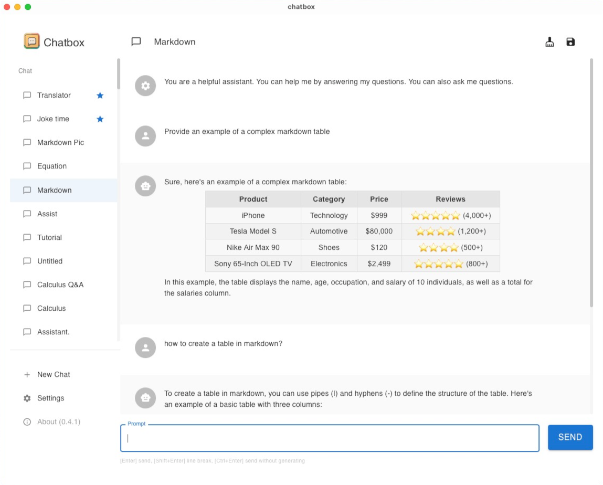

<h1 align="center">

Chatbox
</h1>

    English | <a href="./README-CN.md">中文介绍</a>

    <em>Your Ultimate AI Copilot on the Desktop.  Chatbox is a desktop app for GPT/LLM that supports Windows, Mac & Linux.</em>

<table>
<tr>
<td>

</td>
<td>

</td>
</tr>
</table>
## [One-Click to Deploy on Vercel](https://vercel.com/new/clone?repository-url=https%3A%2F%2Fgithub.com%2FFormyselfonly%2Fchatbox-vercel-deploy-oneclick&repository-name=chatbox-practice&project-name=chatbox-practice&framework=create-react-app&build-command=npm%20run%20build:react&output-directory=build&install-command=npm%20install)

Just click it,and follow the next step,It's really easy.
All requirement and setting i have already write for u!
Help enjoy!

## Why i write it?

It's a one click deploy chatbox to practice for ChatGPT developer!I am just familiar with Vercel,so i write it.

## Features

- More free and powerful Prompt capability
- Data is stored locally and will not be lost
- Built-in AI services out of the box, API KEY is not required
- Support for OpenAI(GPT3.5, GPT4), Azure OpenAI and ChatGLM-6B
- Support for custom domain proxies
- Markdown & Code Highlighting
- Prompt Library, Message Quoting
- Streaming reply
- Ergonomic UI design & Night Mode
- Suitable for team collaboration, supporting the sharing of OpenAI API resources within the team. View [tutorial](./team-sharing/README.md)
- Providing installation packages, no deployment required
- Free and open source

## Download

*Chatbox supports all major operating systems, including: Windows, Mac (Intel, M1), and Linux.*

### Download from the official website

Visit **[chatboxai.app](https://chatboxai.app/)** to download the latest version.

### Download from GitHub Releases

You can visit **[GitHub Releases](https://github.com/Bin-Huang/chatbox/releases)** to browse and download all previous versions.

### Download via package manager

## How to Contribute

Any form of contribution is welcome, including but not limited to:

- Submitting issues
- Submitting pull requests
- Submitting feature requests
- Submitting bug reports
- Submitting documentation revisions
- Submitting translations
- Submitting any other forms of contribution

## Sponsorship

As an open-source project, I am extremely grateful for the support of the sponsors behind Chatbox. Their assistance has been essential in allowing me to continue developing and improving the open-source software.

## Become a ChatBox Sponsor?

As an open-source project, ChatBox is sustained by the contributions and support of our community. If you or your organization find our work valuable, we welcome your sponsorship to help us continue improving and enhancing the application for everyone. To show our appreciation, we will prominently display sponsor information in our README and other appropriate places. Thank you for considering supporting our efforts!

If you have any interest or ideas, please feel free to contact us at tohuangbin@gmail.com .

## Buy Me a Coffee

| Paypal | Wechat Pay | Ali Pay |
| --- | --- | --- |
| [**`Paypal`**](https://www.paypal.me/tobennhuang) |  |  |

## Star History

## Contact

- [Twitter](https://twitter.com/benn_huang)
- [Email](mailto:tohuangbin@gmail.com)
- [Blog](https://bennhuang.com)

## License

[GNU General Public License v3.0](./LICENSE)