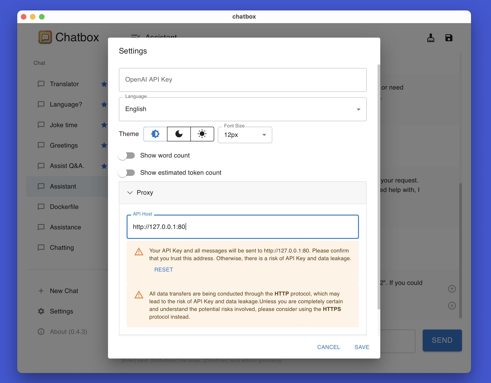
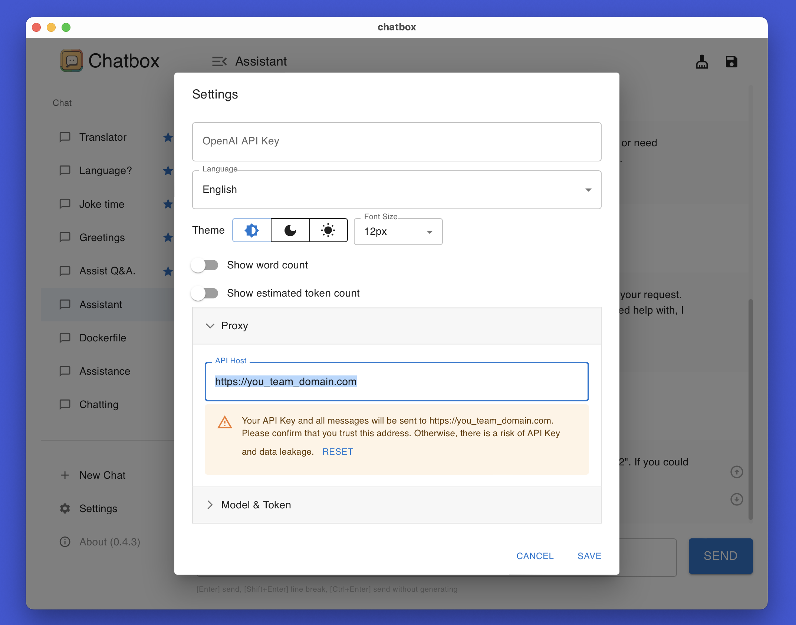

# Chatbox 团队共享功能

[English](./README.md) | 中文介绍 | [繁體中文介紹](./README-TC.md)

Chatbox 可以让你的团队成员共享同一个 OpenAI API 账号的资源，同时不会暴露你的 API KEY。

下面的教程将帮助你快速搭建一个共享服务器。
接下来可能涉及到服务器登录、命令行输入等操作，如果你不熟悉这些操作，可以请你的技术同事帮忙，或者询问 ChatGPT。相信我，这并不困难。

## 1. 准备一台服务器

你可以在 AWS、Google Cloud、Digital Ocean、或腾讯云海外等云平台上启动一个云服务器。
请注意服务器的网络环境必须可以正常访问 `openai.com`。

## 2. 环境安装

登陆你的服务器，执行下面的命令
```shell
curl -fsSL https://get.docker.com -o get-docker.sh
sh get-docker.sh
```

## 3. 启动 Chatbox 共享服务器（HTTP）

- 将下面 `<YOUR_OPENAI_KEY>` 替换成你的 OpenAI API KEY。
- 执行下面的命令，启动服务器。

```shell
docker run -p 80:80 -p 443:443 \
-v ./caddy_config:/config -v ./caddy_data:/data \
-e KEY=<YOUR_OPENAI_KEY> \
bensdocker/chatbox-team 
```

示例：
```shell
docker run -p 80:80 -p 443:443 \
-v ./caddy_config:/config -v ./caddy_data:/data \
-e KEY=sk-xxxxxxxxxxxxxxxxxxx \
bensdocker/chatbox-team 
```

## 4. 启动 Chatbox 共享服务器（HTTPS，推荐）

如果你有一个域名，那么可以使用 HTTPS 来启动服务器，这样所有的对话消息在网络传输时都以密文加密，在隐私上更安全。

- 让你的域名解析到这台服务器（并等待五分钟生效）；
- 将下面 `<YOUR_DOMAIN>` 替换成你域名；
- 将下面 `<YOUR_OPENAI_KEY>` 替换成你的 OpenAI API KEY；
- 执行下面的命令，启动服务器。

```shell
docker run -p 80:80 -p 443:443 \
-v ./caddy_config:/config -v ./caddy_data:/data \
-e HOST=<YOUR_DOMAIN> \
-e KEY=<YOUR_OPENAI_KEY> \
bensdocker/chatbox-team 
```

示例：
```shell
docker run -p 80:80 -p 443:443 \
-v ./caddy_config:/config -v ./caddy_data:/data \
-e HOST=proxy.chatbox.run \
-e KEY=sk-xxxxxxxxxxxxxxxxxx \
bensdocker/chatbox-team 
```

## 5. 分享服务器地址

- 如果你启动的是 HTTP，那么地址是 `http://<你的服务器IP>:80`；
- 如果你启动的是 HTTPS，那么地址是 `https://<你的域名>`。

向你的团队成员分享服务器地址。他们只需要在 Chatbox 设置中的 `API Host` 中填入地址，**不需要填写 API KEY**，就可以共享 OpenAI API 资源了。




