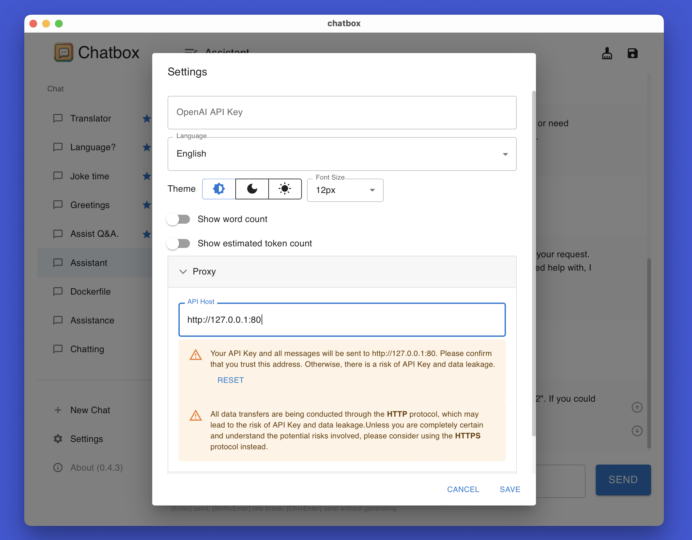
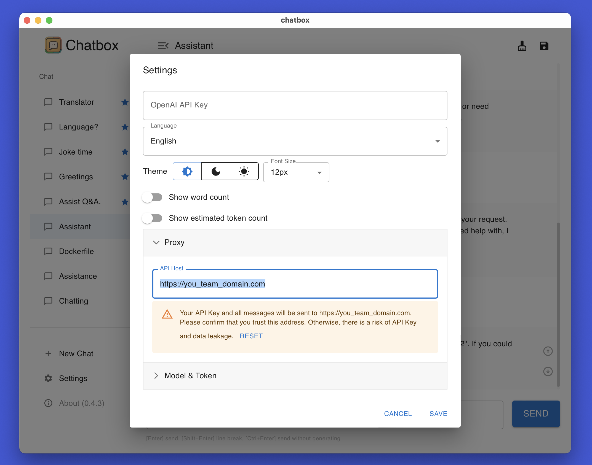

# Chatbox 團隊共享功能

[English](./README.md) | [中文介绍](./README-CN.md) | 繁體中文介紹

Chatbox 可以讓你的團隊成員共享同一个 OpenAI API 帳號的資源，同時不會暴露你的 API KEY。

下面的教程將幫助你快速搭建一个共享服務器。
接下來可能涉及到服務器登錄、命令行輸入等操作，如果你不熟悉這些操作，可以請你的技術同事幫忙，或著詢問 ChatGPT。相信我，這並不困難。

## 1. 準備一台服務器

你可以在 AWS、Google Cloud、Digital Ocean、或騰訊雲海外等雲平台上啟動一個雲服務器。
請注意服務器的網路環境必須可以正常訪問 `openai.com`。

## 2. 環境安裝

登錄你的服務器，執行下面的命令
```shell
curl -fsSL https://get.docker.com -o get-docker.sh
sh get-docker.sh
```

## 3. 啟動 Chatbox 共享服務器（HTTP）

- 將下面 `<YOUR_OPENAI_KEY>` 替換成你的 OpenAI API KEY。
- 執行下面的命令，啟動服務器。

```shell
docker run -p 80:80 -p 443:443 \
-v ./caddy_config:/config -v ./caddy_data:/data \
-e KEY=<YOUR_OPENAI_KEY> \
bensdocker/chatbox-team 
```

示例：
```shell
docker run -p 80:80 -p 443:443 \
-v ./caddy_config:/config -v ./caddy_data:/data \
-e KEY=sk-xxxxxxxxxxxxxxxxxxx \
bensdocker/chatbox-team 
```

## 4. 啟動 Chatbox 共享服務器（HTTPS，推薦）

如果你有一個域名，那麼可以使用 HTTPS 來啟動服務器，這樣所有的對話消息在網路傳輸時都以密文加密，在隱私上更安全。

- 讓你的域名解析到這台服務器（並等待五分鐘生效）；
- 將下面 `<YOUR_DOMAIN>` 替換成你域名；
- 將下面 `<YOUR_OPENAI_KEY>` 替換成你的 OpenAI API KEY；
- 執行下面的命令，啟動服務器。

```shell
docker run -p 80:80 -p 443:443 \
-v ./caddy_config:/config -v ./caddy_data:/data \
-e HOST=<YOUR_DOMAIN> \
-e KEY=<YOUR_OPENAI_KEY> \
bensdocker/chatbox-team 
```

示例：
```shell
docker run -p 80:80 -p 443:443 \
-v ./caddy_config:/config -v ./caddy_data:/data \
-e HOST=proxy.chatbox.run \
-e KEY=sk-xxxxxxxxxxxxxxxxxx \
bensdocker/chatbox-team 
```

## 5. 分享服務器地址

- 如果你啟動的是 HTTP，那麼地址是 `http://<你的服務器IP>:80`；
- 如果你啟動的是 HTTPS，那麼地址是 `https://<你的域名>`。

向你的團隊成員分享服務器地址。他们只需要在 Chatbox 設置中的 `API Host` 中填入地址，**不需要填寫 API KEY**，就可以共享 OpenAI API 資源了。




